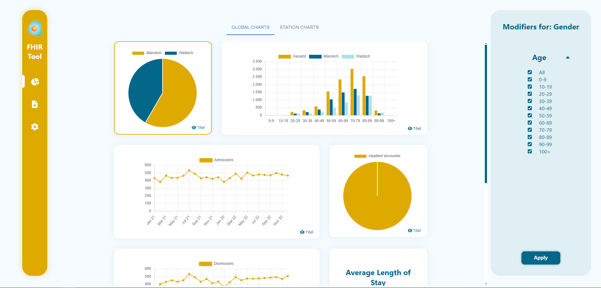
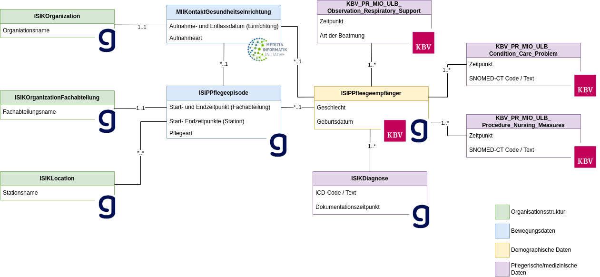

# FHIR Nursing Dashboard



## Project Description

This project is a web application that allows users to view and interact with FHIR resources. The application is built
using React.
The application is designed to be used by healthcare professionals to view and interact with patient data.
The dashboard features FHIR-profiles specified within the official ISiP/ISiK and PIO ULB specifications shown as in the graphic below.



## Setup

To run the application, you need to have Node.js installed on your machine. You can download Node.js from the official
website: [Node.js](https://nodejs.org/en/).
The Project was built using Webstorm by Jetbrains, so it is recommended to
use this IDE to run the project. You can download Webstorm from the official
website: [Webstorm](https://www.jetbrains.com/webstorm/).

Clone the repository to your local machine. The Project is using the React framework, so you need to install the
dependencies
by running the following command in the project directory:

```bash
npm install
```

The connection parameters for the FHIR server are configured in
the ```constants.js``` file in the ```src/utils``` folder. If the server address, user or password changes, you need to
update the
file.

To start the application, run the following command in the project directory:

```bash
npm start
```

or run the application in Webstorm by clicking on the green play button in the top right corner.

## Available Scripts

In the project directory, you can run:

### `npm start`

Runs the app in the development mode.\
Open [http://localhost:3000](http://localhost:3000) to view it in your browser.

The page will reload when you make changes.\
You may also see any lint errors in the console.

### `npm test`

Launches the test runner in the interactive watch mode.\
See the section about [running tests](https://facebook.github.io/create-react-app/docs/running-tests) for more
information.

### `npm run build`

Builds the app for production to the `build` folder.\
It correctly bundles React in production mode and optimizes the build for the best performance.

The build is minified and the filenames include the hashes.\
Your app is ready to be deployed!

See the section about [deployment](https://facebook.github.io/create-react-app/docs/deployment) for more information.

### `npm run eject`

**Note: this is a one-way operation. Once you `eject`, you can't go back!**

If you aren't satisfied with the build tool and configuration choices, you can `eject` at any time. This command will
remove the single build dependency from your project.

Instead, it will copy all the configuration files and the transitive dependencies (webpack, Babel, ESLint, etc) right
into your project so you have full control over them. All of the commands except `eject` will still work, but they will
point to the copied scripts so you can tweak them. At this point you're on your own.

You don't have to ever use `eject`. The curated feature set is suitable for small and middle deployments, and you
shouldn't feel obligated to use this feature. However we understand that this tool wouldn't be useful if you couldn't
customize it when you are ready for it.

## Adding new Graphs

To add a new type of graph to the application, you need to create a new component in the ```src/components/graphs```
folder. The Component can be oriented on the existing components in the folder.

To display a graph type that allready exists with new Data, you need to add a new ```DataProcessor``` in
the ```init_charts.js``` file in the ```src/utils``` folder. The new DataProcessor needs to be added to
the ```dataProcessors``` array in the ```init_charts.js``` file. You can orient on the existing DataProcessors in the
file.
