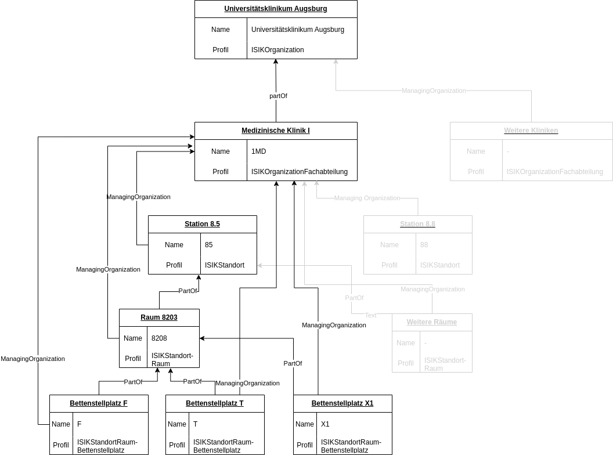
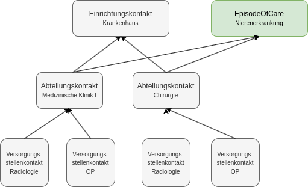

## Used Profiles

Also see https://git.rz.uni-augsburg.de/misit-proj/careregio/-/issues/107.

- FHIR Version: **R4**.


### Patient (magingOrg Referenz falsch)

- https://simplifier.net/isip/isippflegeempfaenger

- Used elements: `gender`, `birthDate`.

- Corresponding Organization referenced using `managingOrganization`:

  ```json
  {
    "fullUrl": "http://localhost:8080/fhir-server/api/v4/Patient/18e80b84609-c13a989d-cd48-4b5f-a853-3a39cf2f68ce",
    "resource": {
        "resourceType": "Patient",
        "id": "18e80b84609-c13a989d-cd48-4b5f-a853-3a39cf2f68ce",
        "gender": "female",
        "managingOrganization": {
            "reference": "Organization/18e80a43c52-4a8da8b6-8a40-4631-ade6-182c6bdc041f"
        }
    }
  }
  ```

- Saved by app in store `patients`.

- Usages:

  - GenderDataProcessor
  - AgeDataProcessor
  - 
  
  

### Organization

- This application uses a hierarchy of the three following profiles on organization.
- Used elements: .
- Examplary structure:

  


#### Krankenhaus (hospital)

- https://simplifier.net/isik-basis-v4/isikorganisation.


#### Fachabteilung (FA, einzelne medizinische Fachkliniken)

- https://simplifier.net/isik-basis-v4/isikorganisationfachabteilung.


### Location

#### Stationen (wards)

- https://simplifier.net/isik-basis-v4/isikstandort.


### Bewegungsdaten (Encounter)

- Application only uses highest and second highest level of hierarchy ('Einrichtungskontakt', 'Abteilungskontakt').
- Example:

​	

- Used for saving an interaction of a patient with a healthcare provider.

- Usages:

  - AdmissionDatesDataProcessor
  - DismissionDatesDataProcessor
  - EncounterTypesDataProcessor
  - LengthOfStayDataProcessor

- Types:

  - Einrichtungskontakte:
    - https://simplifier.net/medizininformatikinitiative-modulfall/mii_pr_fall_kontaktgesundheitseinrichtung
    - Used elements: `period.start`, `period.end`.

  - Abteilungskontakte:
    - https://simplifier.net/isip/isippflegeepisode
    - References Fachabteilung (`serviceProvider`) as well as station (`location:Station`, multiple entries possible!)
    - Not one resource per unique encounter, but one resource can store multiple individual encounters with different stations / different time periods!


  

### Condition

- https://simplifier.net/packages/de.gematik.isik-basismodul/4.0.3/files/2736480

- Stored by app in store `conditions`.

- Usages:
  - DiseaseDataProcessor (counts condition for each code)


### Procedure ?

- Saves regular procedures, i.e. 'Fall prevention' (Pflegemassnahmen).
- Usages:
  - ProceduresDataProcessor (counting procedures per day)
  - IndividualProceduresDataProcessor (counting procedures per procedure and day)


### Observation

- https://simplifier.net/ulb/kbv_pr_mio_ulb_observation_respiratory_support ?

- Examples: `Artificial respiration (procedure)` (Shows the occurence of respiratory support ("Atemunterstützung")).

- Usages:
  - ArtificialRespirationDataProcessor (counting artificial resperiration procedures per day)
