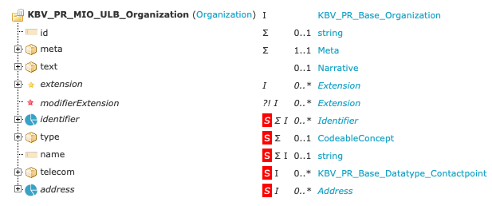
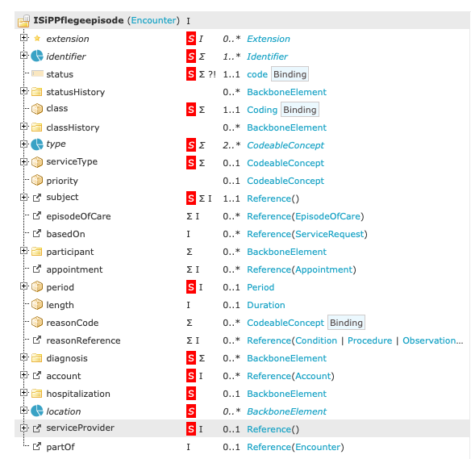

## Used Profiles

Also see Masterarbeit Florian Weber, section 2.5.2.


### **KBV_PR_MIO_ULB_Organization** / Organization

- Saves information about hospital.

- https://simplifier.net/ulb/kbv_pr_mio_ulb_organization

- structure:

  

- example:

  ```json
  {
  "fullUrl": "http://localhost:8080/fhir-server/api/v4/Organization/18e80a43c52-4a8da8b6-8a40-4631-ade6-182c6bdc041f",
    "resource": {
      "resourceType": "Organization",
      "id": "18e80a43c52-4a8da8b6-8a40-4631-ade6-182c6bdc041f",
      "name": "Universitätsklinikum Augsburg"
    }
  }
  ```

- Not yet saved in Application.


### Patient

- https://simplifier.net/isip/isippflegeempfaenger ?

- Corresponding Organization referenced using `managingOrganization`:

  ```json
  {
    "fullUrl": "http://localhost:8080/fhir-server/api/v4/Patient/18e80b84609-c13a989d-cd48-4b5f-a853-3a39cf2f68ce",
    "resource": {
        "resourceType": "Patient",
        "id": "18e80b84609-c13a989d-cd48-4b5f-a853-3a39cf2f68ce",
        "gender": "female",
        "managingOrganization": {
            "reference": "Organization/18e80a43c52-4a8da8b6-8a40-4631-ade6-182c6bdc041f"
        }
    }
  }
  ```

- Saved by app in store `patients`.


### Conditions

- ungefähr https://simplifier.net/ulb/kbv_pr_mio_ulb_condition_medical_problem_diagnosis

- Saves diagnosed condition / a mdeical diagnose ('Sonstiges akutes Nierenversagen') of a patient.

- example:

  ```json
  {
    "fullUrl": "http://localhost:8080/fhir-server/api/v4/Condition/18e84acbe31-970b183f-0a54-4cfe-a3d0-e59f550b3936",
    "resource": {
        "resourceType": "Condition",
        "id": "18e84acbe31-970b183f-0a54-4cfe-a3d0-e59f550b3936",
        "code": {
            "coding": [
                {
                    "extension": [
                        {
                            "url": "https://fhir.care-regio.de/StructureDefinition/CareRegioIG/StructureDefinition/haupt-neben-diagnose",
                            "valueCoding": {
                                "system": "http://snomed.info/sct",
                                "code": "8319008",
                                "display": "Principal diagnosis"
                            }
                        }
                    ],
                    "system": "http://fhir.de/CodeSystem/bfarm/icd-10-gm",
                    "code": "N17.83",
                    "display": "Sonstiges akutes Nierenversagen: Stadium 3"
                }
            ]
        },
        "subject": {
            "reference": "Patient/18e80be4466-da25ece3-18bd-4825-b918-928876e9db5e"
        }
    }
  }
  ```

- Stored by app in store `conditions`.


### Procedure (Pflegemassnahme?)

- https://simplifier.net/ulb/kbv_pr_mio_ulb_procedure_nursing_measures (angepasst)

- Stores information about some (regular) procedures performed on a patient often by medical staff, i.e., nurses.

- example:

  ```json
    {
      "resource": {
          "resourceType": "Procedure",
          "id": "18e84f6ee60-e3c9ed50-3dcf-426e-a47b-1b56d7ead70e",
          "category": {
              "coding": [
                  {
                      "system": "http://snomed.info/sct",
                      "code": "9632001",
                      "display": "nursing procedure"
                  }
              ]
          },
          "code": {
              "coding": [
                  {
                      "system": "http://snomed.info/sct",
                      "code": "386296001",
                      "display": "Fall prevention (procedure)"
                  }
              ]
          },
          "subject": {
              "reference": "Patient/18e80b8460a-04c730c8-5ef6-4dfd-aac1-c9ea0db1c28e"
          }
      }
  }
  ```

- Stored by app in store `procedures`.


### Observation

- https://simplifier.net/ulb/kbv_pr_mio_ulb_observation_respiratory_support

- Shows the occurence of respiratory support ("Atemunterstützung").

- example:

  ```json
  {
              "fullUrl": "http://localhost:8080/fhir-server/api/v4/Observation/19025309475-4a617d6a-627a-4e63-b610-e40edb83d5f1",
              "resource": {
                  "resourceType": "Observation",
                  "code": {
                      "coding": [
                          {
                              "system": "http://snomed.info/sct",
                              "code": "363787002:704321009=40617009",
                              "display": "Observable entity (observable entity) : Characterizes (attribute) = Artificial respiration (procedure)"
                          }
                      ]
                  },
                  "subject": {
                      "reference": "Patient/18e80b8461c-138e46d4-4b77-43dd-bd92-b55ed23dd70e"
                  }
              }
  }
  ```

- Stored by app in store `observations`.


### **ISiPPflegeepisode** / Encounter

- Used for saving an interaction of a patient with a healthcare provider.

  - structure:
    

    - https://simplifier.net/packages/de.gematik.isip/1.0.2/files/1942635/~overview

    - Corresponding organization mentioned as reference in field `serviceProvider`:

    ```json
    {
        "serviceProvider": {
          "reference": "Organization/18e80a43c52-4a8da8b6-8a40-4631-ade6-182c6bdc041f"
        }
    }
    ```

- `class` saves tpe of encounter. e.g. 'inpatient encounter'.

- Two types of Pflegepisosede used by application: `einrichtungskontakt` and `versorgunskontakt`:

  - Fetching data, `APIWrapper.js` / `useEffect`: 

    ```javascript
    Promise.all([
                        getPatients(updateProgress),
                        getConditions(updateProgress),
                        getEncounters(updateProgress, '&type=einrichtungskontakt'),
                        getEncounters(updateProgress, '&type=versorgungsstellenkontakt'),
                        getProcedures(updateProgress),
                        getObservations(updateProgress),
                    ])
    ```
    
    => Application fetches two types: `einrichtungskontakt` and `versorgungsstellenkontakt`.
  
  - Storing: `db.js` / `insertEncountersIntoDB(encounters, station = false)`:
  
    ```javascript
    if (station) {
        transaction = db.transaction(stationEncountersStore, 'readwrite');
        objectStore = transaction.objectStore(stationEncountersStore);
    } else {
        transaction = db.transaction(encountersStore, 'readwrite');
        objectStore = transaction.objectStore(encountersStore);
    }
    ```
  
    => Ressources of type `einrichtungskontakt` get stored in store `encounters`, those of type `versorgungsstellenkontakt` get stored in `stationEncounters`.


### Location

- Stationen dynamisch parsen

- PhysicalType: Ward

  ```json
  {
      "resourceType": "Bundle",
      "id": "fac8c080-2a33-4772-a233-a062912f2fc4",
      "type": "searchset",
      "total": 4,
      "link": [
          {
              "relation": "self",
              "url": "http://localhost:8080/fhir-server/api/v4/Location?_count=20&_page=1&_firstId=3&_lastId=9"
          }
      ],
      "entry": [
          {
              "fullUrl": "http://localhost:8080/fhir-server/api/v4/Location/18e80b52d25-34291668-80f6-4259-b4b7-dc36743d5835",
              "resource": {
                  "resourceType": "Location",
                  "id": "18e80b52d25-34291668-80f6-4259-b4b7-dc36743d5835",
                  "meta": {
                      "versionId": "1",
                      "lastUpdated": "2024-03-27T16:19:01.02947Z",
                      "profile": [
                          "https://fhir.care-regio.de/StructureDefinition/CareRegioIG/StructureDefinition/cr-location-station"
                      ]
                  },
                  "identifier": [
                      {
                          "system": "www.fhir.care-regio.de/identifier",
                          "value": "UKA:085"
                      }
                  ],
                  "status": "active",
                  "name": "085 - Station 8.5",
                  "physicalType": {
                      "coding": [
                          {
                              "system": "http://snomed.info/sct",
                              "code": "225746001",
                              "display": "Ward (environment)"
                          }
                      ]
                  },
                  "managingOrganization": {
                      "reference": "Organization/18e80a43c52-4a8da8b6-8a40-4631-ade6-182c6bdc041f"
                  }
              },
              "search": {
                  "mode": "match",
                  "score": 1
              }
          },
          {
              "fullUrl": "http://localhost:8080/fhir-server/api/v4/Location/18e80b555bf-3b520381-7e0e-4567-88fb-49a7524de41e",
              "resource": {
                  "resourceType": "Location",
                  "id": "18e80b555bf-3b520381-7e0e-4567-88fb-49a7524de41e",
                  "meta": {
                      "versionId": "1",
                      "lastUpdated": "2024-03-27T16:19:11.423043Z",
                      "profile": [
                          "https://fhir.care-regio.de/StructureDefinition/CareRegioIG/StructureDefinition/cr-location-station"
                      ]
                  },
                  "identifier": [
                      {
                          "system": "www.fhir.care-regio.de/identifier",
                          "value": "UKA:088"
                      }
                  ],
                  "status": "active",
                  "name": "085 - Station 8.8",
                  "physicalType": {
                      "coding": [
                          {
                              "system": "http://snomed.info/sct",
                              "code": "225746001",
                              "display": "Ward (environment)"
                          }
                      ]
                  },
                  "managingOrganization": {
                      "reference": "Organization/18e80a43c52-4a8da8b6-8a40-4631-ade6-182c6bdc041f"
                  }
              },
              "search": {
                  "mode": "match",
                  "score": 1
              }
          },
          {
              "fullUrl": "http://localhost:8080/fhir-server/api/v4/Location/18e80b5c0eb-fc9f74b3-87f8-436d-a555-7e2a667d95db",
              "resource": {
                  "resourceType": "Location",
                  "id": "18e80b5c0eb-fc9f74b3-87f8-436d-a555-7e2a667d95db",
                  "meta": {
                      "versionId": "1",
                      "lastUpdated": "2024-03-27T16:19:38.859301Z",
                      "profile": [
                          "https://fhir.care-regio.de/StructureDefinition/CareRegioIG/StructureDefinition/cr-location-station"
                      ]
                  },
                  "identifier": [
                      {
                          "system": "www.fhir.care-regio.de/identifier",
                          "value": "UKA:IZ21"
                      }
                  ],
                  "status": "active",
                  "name": "IZ21 - Station 2.1",
                  "physicalType": {
                      "coding": [
                          {
                              "system": "http://snomed.info/sct",
                              "code": "225746001",
                              "display": "Ward (environment)"
                          }
                      ]
                  },
                  "managingOrganization": {
                      "reference": "Organization/18e80a43c52-4a8da8b6-8a40-4631-ade6-182c6bdc041f"
                  }
              },
              "search": {
                  "mode": "match",
                  "score": 1
              }
          },
          {
              "fullUrl": "http://localhost:8080/fhir-server/api/v4/Location/18e80b60f0f-95102a48-a505-4c41-a69f-76e216f8b5da",
              "resource": {
                  "resourceType": "Location",
                  "id": "18e80b60f0f-95102a48-a505-4c41-a69f-76e216f8b5da",
                  "meta": {
                      "versionId": "1",
                      "lastUpdated": "2024-03-27T16:19:58.863992Z",
                      "profile": [
                          "https://fhir.care-regio.de/StructureDefinition/CareRegioIG/StructureDefinition/cr-location-station"
                      ]
                  },
                  "identifier": [
                      {
                          "system": "www.fhir.care-regio.de/identifier",
                          "value": "UKA:IZ22"
                      }
                  ],
                  "status": "active",
                  "name": "IZ22 - Station 2.2",
                  "physicalType": {
                      "coding": [
                          {
                              "system": "http://snomed.info/sct",
                              "code": "225746001",
                              "display": "Ward (environment)"
                          }
                      ]
                  },
                  "managingOrganization": {
                      "reference": "Organization/18e80a43c52-4a8da8b6-8a40-4631-ade6-182c6bdc041f"
                  }
              },
              "search": {
                  "mode": "match",
                  "score": 1
              }
          }
      ]
  }
  ```

  
